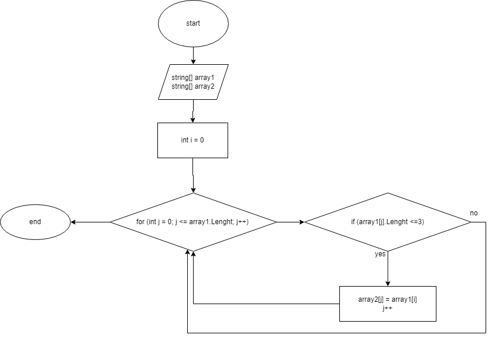

#  Итоговая проверочная работа

## Задача:
Написать программу, которая из имеющегося массива строк формирует массив из строк, длина которых меньше либо равна 3 символа. Первоначальный массив можно ввести с клавиатуры, либо задать на старте выполнения алгоритма. При решении не рекомендуется пользоваться коллекциями, лучше обойтись исключительно массивами. 

## Описание алгоритма решения:
1. Ввод первоначального массива, создание пустого 2го массива, соразмерного с 1м массивом.
2. Создание метода, в котором 1й массив перебирается при помощи цикла с проверкой условия <=3. Если условие выполняется, то j-ый элемент 1го массива присваивается i-му элементу 2го массива (блок-схема данного алгоритма представлена ниже).
3. Создание метода, который выведет ответ, а именно, вывод 2го массива  из строк, длина которых будет меньше либо равна 3 символам.

## Блок-схема основного алгоритма (заполнение 2го массива) представлена на изображении ниже:

## Написание программы на языке C# представлено в файле Program.cs.

